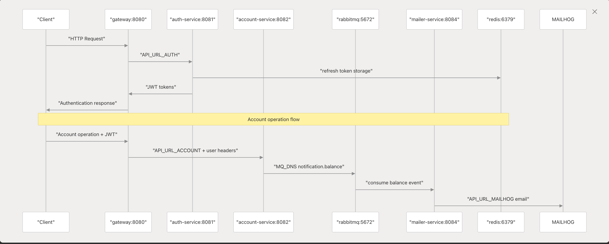
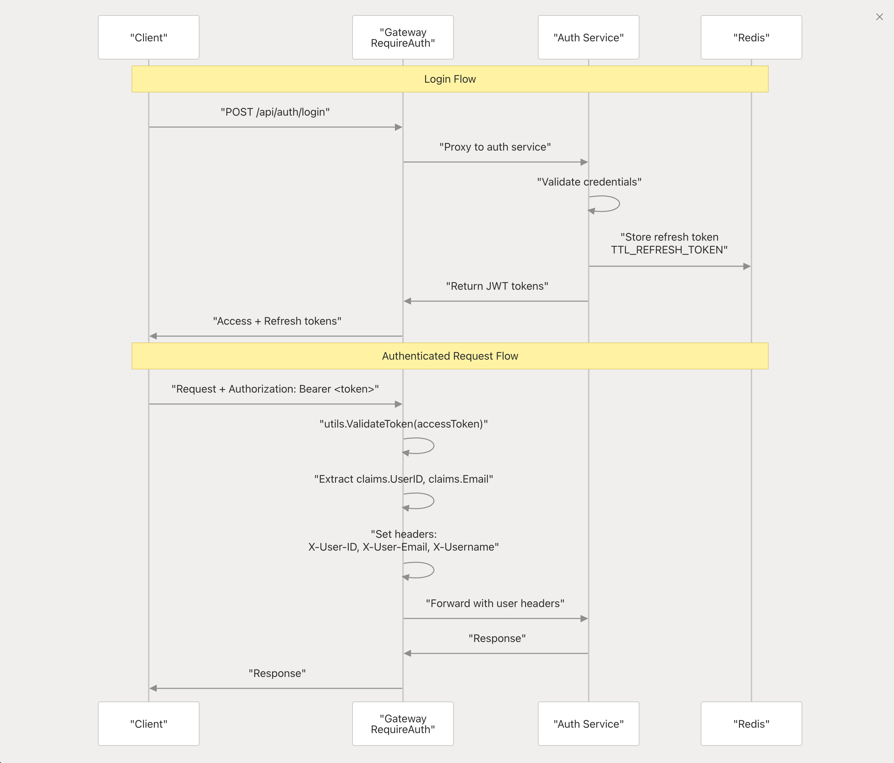
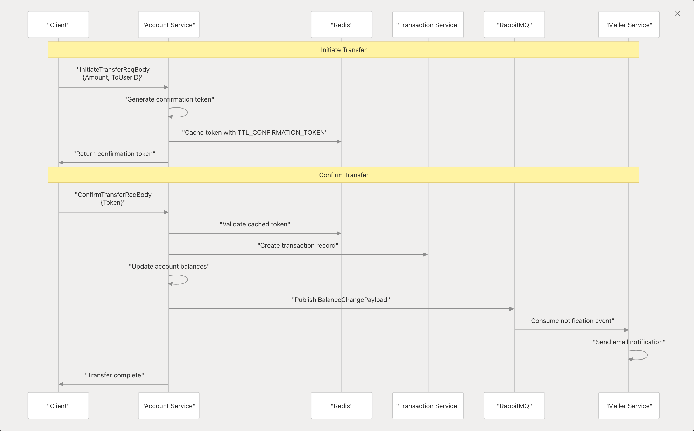

<h1 align="center">
    🏬 Nanobank 
</h1>
<p align="center">
  <a href="https://github.com/cushydigit/microstore/LICENSE">
    
  </a>
  
  
  
  
</p>
<p align="center">
NanoBank is a modular, containerized **banking microservices** project built in Go, designed for local development and deployment using **Docker Compose** and **Kubernetes (Minikube)**. It includes authentication, account management, transaction tracking, email notifications, and message brokering via RabbitMQ.
</p>

## Services 

- **`gateway`** : API Gateway, entrypoint for clients
- **`auth-service`** : register login logout, secure with JWT refresh token rotation
- **`account-service`** : manage user acccount and balance, deposit, withdraw and transfer between accounts
- **`transaction-service`** : the transaction history and status
- **`mialer-service`** : email cmpt protocol vai Mailhog
- **`postgres`** : sql database with persistance
- **`redis`** : used for session/token management
- **`mailhog`** : mail teseting web UI 

## Getting Started

The project requires `Go` ,`Docker` and `Make` to get started.

clone the repo:
```bash
git clone https://github.com/cushydigit/nanobank.git
cd nanobank
```

run services:
```
make up
```

stop services:
```
make stop
```

## Technology Stack 

- **`Language`**: Go 1.24
- **`Architecture`**: Clean Architecture with microservices
- **`Communication`**: REST APIs over HTTP protocol
- **`Containerizaion`**: Docker
- **`Orchestrates`**: Docker compose || Kubernetes (Minikube)
- **`Database`**: PostgreSQL
- **`Broker`**: RabbitMQ
- **`Cache`**: Redis 
- **`Email `Testing**: Mailhog
- **`Build `System**: Makefile with common commands
- **`API `Tesing**: Postman collection included

## Kubernetes Setup (Minikube)
Make sure you ahave Minikube[http://google.com] installed

Start minikube and deploy
```
make start
make build
make deploy
```

## Structure Overview

```tree

nanobank/
├── gateway/                # API Gateway routing external HTTP traffic to services
├── auth-service/           # Handles user registration, login, authentication
├── account-service/        # Handles account creation, deoposit, withdraw and transfer
├── transaction-service/    # Handles get transactions
├── mailer-service/         # Used for internal services sending the token confirmation etc (notifications)
├── shared/                 # Common utilities, middleware, DB, Redis, search clients
├── deployments/            
│   ├── docker-compose.yml  # Orchestrates via docker compose
│   └── k8s/                # Orchestrates setup files via kubernetes (Minikube) 
└── Makefile                # Common build and run commands

```

## Request Processing Flows

### overview flow



### auth flow


### transfer flow 


## Postman Collection

You can use the Postman collection to test all available endpoints:
[](https://www.postman.com/material-astronaut-37601285/workspace/cushydigit/collection/21076955-fe36b2ea-fa91-4ae1-a392-c70e2a5b8a48?action=share&creator=21076955)

## License

This project is for educational and portfolio purposes. Feel free to use it as a reference or learning resource.


